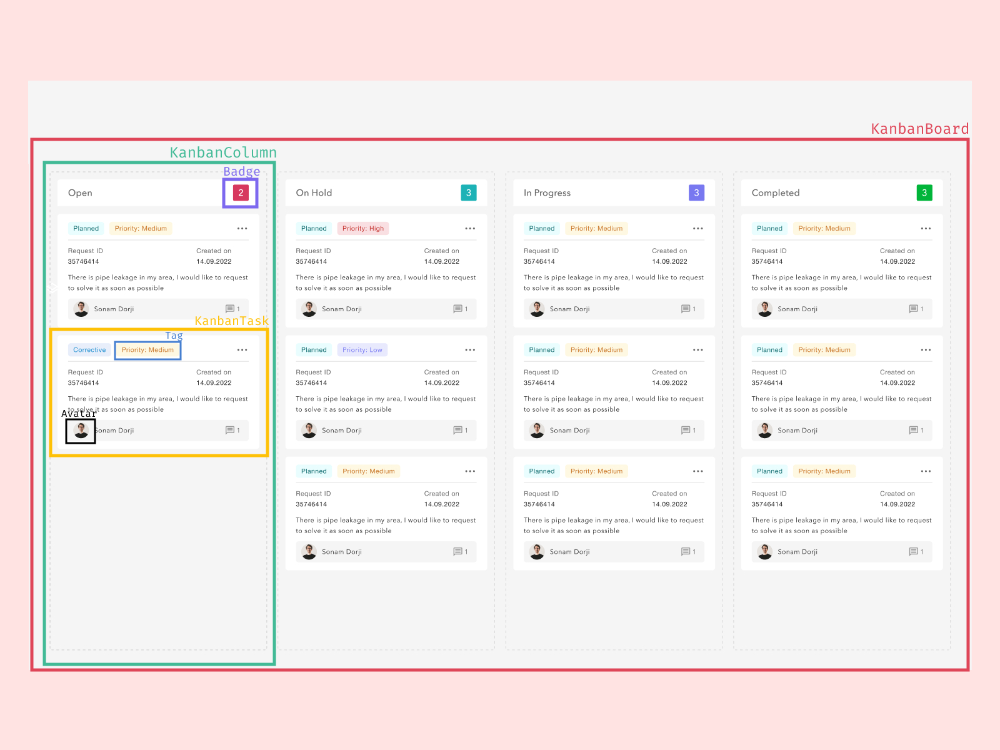

# Modüler Frontend Tasarım: Component’lerin Temel İlkeleri ve Kullanımı

# Component Nedir?

Component dediğimiz şey tekrar kullanılabilen parçalardır. En küçük parçadan en büyük parçaya her şey component olabilir. HTML içerisinde kullandığımız elementlerde aslında birer componenttir. Fakat biz frontend geliştirirken HTML’in sunduğu hazır componentler bize yetmez ve biz kendi özel componentlerimizi yazarız.

**HTML SELECT:**

**CUSTOM SELECT:**

# Component Kullanmanın Avantajları

• Bir kere yazıldıktan sonra istenilen her yerde kullanabilme imkanı sunar.

• Component yapısı sayesinde kod tekrarlarından kaçınılır.

• Componentler geliştirilen projenin yapısına göre mantıksal parçalara bölünebilir.

• Veriler **Props** olarak gönderilir.

• Tarayıcılar arasında ki farkları da etkisiz kılar.

• Test etmesi daha kolaydır.

_Büyük parçalara göre ufak parçaların test edilmesi daha kolaydır._

# Component Kullanmanın Dezavantajları

• Componentler belli mantık çerçevesinde parçalanmazlarsa geliştirme aşamasında zorluk yaratır.

• Component isimlendirmeleri aynı şekilde belli bir mantık çevresinde olmazsa kafa karışıklığına neden olabilirler.

• Sınırlı sayıda konfigürasyon.

# Component’leri Doğru Ayırmak/Parçalamak

Componentleri parçalarken belli bir mantık çerçevesinde parçalamamız gerekir. Yeniden kullanılabilirliğine dikkat etmemiz gerekir. Birebir aynı ama çok ufak farklar olan componentleri ayrı ayrı yazmak yerine tek bir component olarak yazıp props değeri ile bu farklılığı yaratabiliriz.

# Workshop Örneği

Bu workshopta örneğimiz bir kanban olacak. Aşağıdaki gibi bir arayüzümüz var. Öncelikle bu arayüzü inceleyelim. Ne ve neresi component olacak buna karar verelim.

1. İlk olarak arayüze baktığımızda bir tane **KanbanBoard** isimli bir componentimizin olması gerektiğini görüyoruz. Çünkü bu component çok fazla alt kırılımı olan bir component, ve biz bu componenti başka bir sayfada da kullanmak isteyebiliriz.

**KanbanBoard** componentimiz butun bir yapıyı tek bir arada tutuyor ve tek bir props alıyor*(örneğimize göre)*.

### KanbanBoard Props:

1. **KanbanBoard** componentimizi incelediğimizde içerisinde birbirine benzer yapılar olduğunu görüyoruz ve bunları da component hale getirebiliriz. Bu componentlerimiz ise **KanbanColumn** componentleri olacak.

**KanbanColumn** componentimiz içerisinde başlığı ve görevleri bir arada tutuyor.

### KanbanColumn Props:

1. **KanbanColumn** componentimiz içerisinde ise **bir adet** sütun başlığı var. bu sütün başlığını component yapmamıza gerek yok. Çünkü biz **KanbanColumn** componentini **for/map** ile döneceğiz ve her sütun içerisinde zaten bir adet var ve bu başka bir yerde kullanılmayacak. Ama içerinde bir adet o sütun içerinde kaç tane kart olduğunu gösteren bir **Badge** componenti var.

**Badge** componenti sadece kanbana ait değil **projenin her yerinde kullanılacak bir component olduğundan ismine de genel bir isim veriyoruz.**

**Badge** componentimiz **KanbanColumn** içerisinde kaç adet görev varsa onun sayısını tutuyor.

### Badge Props:

1. **KanbanColumn** componentini incelemeye devam ettiğimizde içerisinde yine tekrar eden alanlar bulunmakta bu alanları da **KanbanTask** isimli bir component olarak ayırabiliriz.

**KanbanTask** componentimiz içerisinde görevin açıklamasını, etiketleri, yaratılış tarihini, görevin atandığı kullanıcıyı ve yorum sayısını gösteriyor.

### KanbanTask Props:

### KanbanTask Props(alternative):

1. **KanbanTask** componentimiz içerisinde ise iki adet componentimiz daha var. Bunlar **Tag** ve **Avatar** componentleri. Bu component isimlerinde de **Kanban**… diye başlamadık çünkü bu componentlerde projenin yer yerinde kullanılabilecek componentler.

**Tag** componentimiz **KanbanTask** içerisindeki etiketlerin renkli gösterimlerini sağlıyor.

### Tag Props:

**Avatar** componentimiz **KanbanTask** içerisindeki görevin atandığı kullanıcının görselini gösterir.

### Avatar Props:

Arayüzümüzü teoride inceledik ve parçalayacağımız componentleri ve componentlerin propslarini belirledik. Şimdi pratiğe geçelim…
